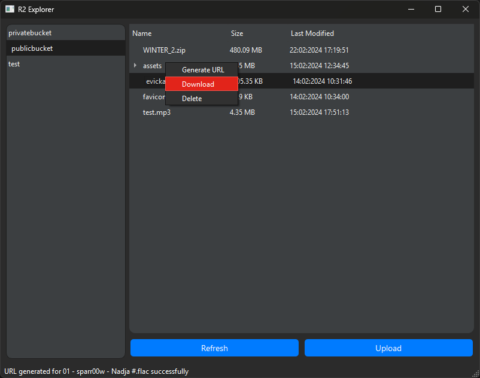

# R2 Explorer

A very simple Cloudflare R2 file explorer build using Python and PyQT6

## Features

- List all available R2 buckets
- List all objects in a specific bucket
- Download an object from R2
- Upload an object to R2
- Delete an object from R2
- Generate a download link for an R2 object (1 hour valid)
- Colorful GUI (100% not intented)

## Installation

Prerequisites: - Python 3+

1. Clone the repository

```bash
git clone https://github.com/evickastudio/r2-explorer.git
```

2. Install the requirements

```bash
pip install -r requirements.txt
```

## Usage

1. Create an "Admin Read & Write" API Token on your Cloudflare Dashboard.
   - To list all available R2 buckets, you need this permission.
2. Rename the file [`config.json.sample`](config.json.sample) to `config.json` and fill the fields with your credentials and account ID.

   Example `config.json`:

   ```json
   {
     "ACCOUNT_ID": "ACCOUNT_ID HERE",
     "CLIENT_ACCESS_KEY": "CLIENT_ACCESS_KEY HERE",
     "CLIENT_SECRET": "CLIENT_SECRET HERE"
   }
   ```

3. Run the script
   ```bash
   python main.py
   ```

## License

Distributed under the Apache License. See [LICENSE](LICENSE) for more information.

## Preview

Now with cool Icon!




## Contributing

Feel free to contribute to this project by creating pull requests, issues or forking the repository.